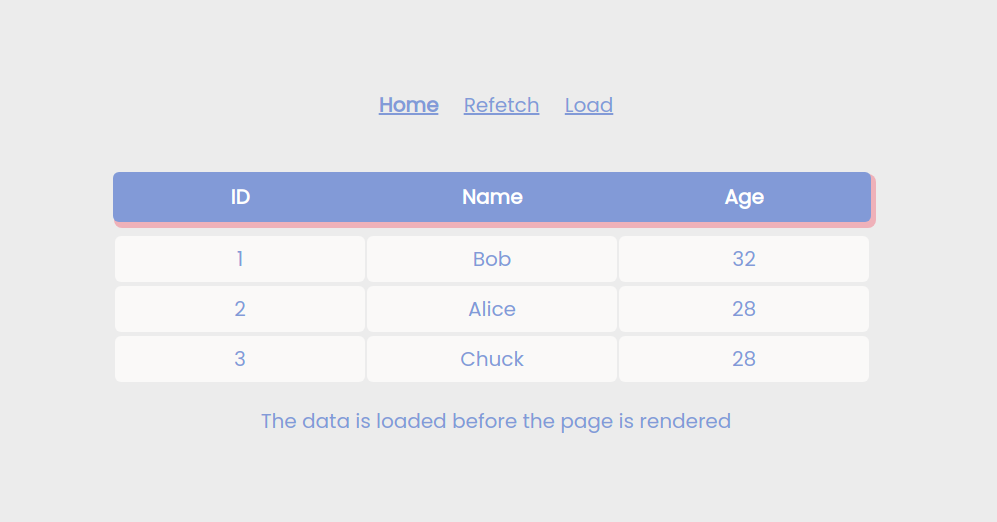

# How to configure Apollo GraphQL in Nuxt application

This is a simple example of how to set up Apollo GraphQl in a Nuxt application.



EN: https://maddevs.io/blog/configure-apollo-graphql-in-nuxtjs/

RU: https://medium.com/maddevs-io/kak-nastroit-apollo-graphql-v-nuxt-prilozhenii-d59d5ec7392a

## Usage

### Run Nuxt

```bash
npm run dev
```

Link to demo page http://localhost:3000

Link to GraphQL UI http://localhost:3000/graphql
